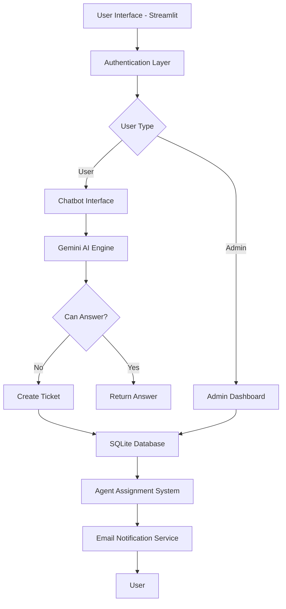

# 🎫 AI-Powered Complaint Management System

<div align="center">


**An intelligent, enterprise-grade complaint management system powered by AI**

[Features](#-features) • [Demo](#-demo) • [Installation](#-installation) • [Usage](#-usage) • [Configuration](#-configuration) • [Contributing](#-contributing)

</div>

---

## 📋 Table of Contents

- [Overview](#-overview)
- [Features](#-features)
- [Architecture](#-architecture)
- [Technologies Used](#-technologies-used)
- [Installation](#-installation)
- [Configuration](#-configuration)
- [Usage](#-usage)
- [Project Structure](#-project-structure)
- [API Integration](#-api-integration)
- [Database Schema](#-database-schema)
- [Screenshots](#-screenshots)
- [Contributing](#-contributing)
- [License](#-license)
- [Contact](#-contact)

---

## 🌟 Overview

The **AI-Powered Complaint Management System** is a sophisticated web application designed to streamline customer support operations. Built with **Streamlit** and powered by **Google's Gemini AI**, this system intelligently handles customer queries, automatically categorizes complaints, assigns agents based on workload and skills, and provides real-time ticket tracking.

### 🎯 Key Highlights

- 🤖 **AI-Powered Chatbot** using Google Gemini 2.5 Pro
- 📊 **Intelligent Ticket Routing** with priority detection
- 👥 **Smart Agent Assignment** based on workload and skills
- 📧 **Email Notifications** for ticket status updates
- 🔒 **Secure Authentication** with password hashing
- 📈 **Admin Dashboard** for monitoring and management
- 💾 **SQLite Database** for data persistence
- 🔍 **RAG (Retrieval-Augmented Generation)** for FAQ matching

---

## ✨ Features

### For Users

- **🗨️ Interactive Chatbot**
  - Ask questions and get instant answers from FAQ knowledge base
  - Automatic ticket creation when AI cannot resolve the query
  - Natural language understanding powered by Gemini AI

- **🎫 Ticket Management**
  - Real-time ticket tracking with unique IDs
  - View all your tickets in one place
  - Automatic categorization (Shipping, Refund, Login, Cancellation)
  - Priority assignment (High, Medium, Low)

- **📝 Feedback System**
  - Provide feedback on resolved tickets
  - Help improve service quality

- **📚 FAQ Access**
  - Browse frequently asked questions
  - Self-service support resources

### For Administrators

- **📊 Comprehensive Dashboard**
  - View all tickets across the system
  - Monitor ticket status and priority
  - Track agent workload distribution

- **👤 Agent Management**
  - Assign/reassign tickets to agents
  - View agent workload and availability
  - Skill-based agent matching

- **🔄 Status Updates**
  - Update ticket status (Pending, In Progress, Resolved, Closed)
  - Automatic email notifications to users
  - Bulk operations support

- **📈 Analytics**
  - Export ticket history to CSV
  - Track resolution times
  - Monitor system performance

---

## 🏗️ Architecture



---

## 🛠️ Technologies Used

| Technology | Purpose |
|------------|---------|
| **Python 3.x** | Core programming language |
| **Streamlit** | Web application framework |
| **Google Gemini AI** | Natural language processing and RAG |
| **SQLite** | Database management |
| **scikit-learn** | TF-IDF vectorization |
| **FAISS** | Vector similarity search |
| **pandas** | Data manipulation and CSV export |
| **smtplib** | Email notification system |
| **hashlib** | Password encryption |

---

## 🚀 Installation

### Prerequisites

- Python 3.8 or higher
- pip package manager
- Google Cloud account with Gemini API access
- Gmail account for email notifications (optional)

### Step-by-Step Setup

1. **Clone the Repository**
   ```bash
   git clone https://github.com/MuditIsOP/ibm.git
   cd ibm
   ```

2. **Create Virtual Environment** (Recommended)
   ```bash
   python -m venv venv
   
   # On Windows
   venv\Scripts\activate
   
   # On macOS/Linux
   source venv/bin/activate
   ```

3. **Install Dependencies**
   ```bash
   pip install -r requirements.txt
   ```

4. **Set Up Configuration**
   Create a `.streamlit/secrets.toml` file in the project root:
   ```toml
   GOOGLE_API_KEY = "your-google-gemini-api-key"
   SENDER_EMAIL = "your-email@gmail.com"
   SENDER_EMAIL_PASSWORD = "your-app-password"
   ```

5. **Run the Application**
   ```bash
   streamlit run app.py
   ```

6. **Access the Application**
   - Open your browser and navigate to `http://localhost:8501`
   - Default admin credentials:
     - Email: `admin@test.com`
     - Password: `admin123`

---

## ⚙️ Configuration

### Google Gemini API Setup

1. Visit [Google AI Studio](https://makersuite.google.com/app/apikey)
2. Create a new API key
3. Add the key to your `secrets.toml` file

### Email Notification Setup

1. Enable 2-Factor Authentication on your Gmail account
2. Generate an [App Password](https://support.google.com/accounts/answer/185833)
3. Add your email and app password to `secrets.toml`

### Database Configuration

The system automatically creates and initializes the SQLite database (`complaints.db`) on first run with three tables:
- **users**: User authentication and profile information
- **tickets**: Support ticket records
- **agents**: Agent information and workload tracking

---

## 📖 Usage

### For Users

1. **Registration**
   - Click "Register Here" on the login page
   - Enter your email and password
   - Confirm password and register

2. **Login**
   - Use your registered email and password
   - Access the user dashboard

3. **Ask a Question**
   - Type your query in the chatbot interface
   - Receive instant answers from the AI or get a ticket created

4. **Track Tickets**
   - View all your tickets in "My Tickets" section
   - Track specific tickets using Ticket ID
   - Provide feedback on resolved tickets

### For Administrators

1. **Login**
   - Use admin credentials: `admin@test.com` / `admin123`
   - Access the admin dashboard

2. **Manage Tickets**
   - View all tickets in the system
   - Update ticket status
   - Assign/reassign tickets to agents

3. **Monitor Performance**
   - Check agent workload distribution
   - Export ticket data to CSV
   - Review system analytics

---

## 📁 Project Structure

```
ibm/
│
├── app.py                  # Main Streamlit application
├── main.py                 # Alternative entry point
├── requirements.txt        # Python dependencies
├── complaints.db          # SQLite database (auto-generated)
│
├── .streamlit/
│   └── secrets.toml       # API keys and credentials (not in repo)
│
└── README.md              # This file
```

---

## 🔌 API Integration

### Gemini AI Integration

The system uses Google's Gemini 2.5 Pro model for:

1. **Query Understanding**: Analyzing user intent and sentiment
2. **Priority Detection**: Assigning urgency levels based on keywords and context
3. **RAG Implementation**: Matching queries with FAQ knowledge base
4. **Automated Responses**: Generating contextual answers

### Example API Call

```python
def ask_gemini(prompt):
    model = genai.GenerativeModel("gemini-2.5-pro")
    response = model.generate_content(prompt)
    return response.text
```

---

## 🗃️ Database Schema

### Users Table
```sql
CREATE TABLE users (
    email TEXT PRIMARY KEY,
    password_hash BLOB NOT NULL,
    salt BLOB NOT NULL,
    verified BOOLEAN DEFAULT 0
)
```

### Tickets Table
```sql
CREATE TABLE tickets (
    ticket_id TEXT PRIMARY KEY,
    query TEXT NOT NULL,
    status TEXT NOT NULL,
    category TEXT,
    priority TEXT,
    assigned_to TEXT,
    timestamp TEXT,
    user_email TEXT,
    feedback TEXT,
    FOREIGN KEY (user_email) REFERENCES users (email),
    FOREIGN KEY (assigned_to) REFERENCES agents (name)
)
```

### Agents Table
```sql
CREATE TABLE agents (
    name TEXT PRIMARY KEY,
    category TEXT,
    workload INTEGER DEFAULT 0,
    available BOOLEAN DEFAULT 1,
    skills TEXT
)
```

---

## 📸 Screenshots

### User Dashboard


### Admin Panel


### Chatbot Interface


---

## 🤝 Contributing

Contributions are welcome! Here's how you can help:

1. **Fork the Repository**
2. **Create a Feature Branch**
   ```bash
   git checkout -b feature/AmazingFeature
   ```
3. **Commit Your Changes**
   ```bash
   git commit -m 'Add some AmazingFeature'
   ```
4. **Push to the Branch**
   ```bash
   git push origin feature/AmazingFeature
   ```
5. **Open a Pull Request**

### Development Guidelines

- Follow PEP 8 style guidelines
- Add comments for complex logic
- Update documentation for new features
- Test thoroughly before submitting PR

---

## ��� Known Issues & Future Enhancements

### Current Limitations
- Email notifications require Gmail with app passwords
- Single admin account only
- Limited to English language queries

### Planned Features
- [ ] Multi-language support
- [ ] Advanced analytics dashboard
- [ ] Mobile responsive design
- [ ] Integration with Slack/Teams
- [ ] Voice input support
- [ ] Sentiment analysis visualization
- [ ] Role-based access control (RBAC)
- [ ] API endpoint for external integrations

---

## 📄 License

This project is licensed under the MIT License - see the [LICENSE](LICENSE) file for details.

---

## 📧 Contact

**Mudit**
- GitHub: [@MuditIsOP](https://github.com/MuditIsOP)
- Project Link: [https://github.com/MuditIsOP/ibm](https://github.com/MuditIsOP/ibm)

---

## 🙏 Acknowledgments

- [Streamlit](https://streamlit.io/) for the amazing web framework
- [Google Gemini](https://deepmind.google/technologies/gemini/) for powerful AI capabilities
- [FAISS](https://github.com/facebookresearch/faiss) for efficient similarity search
- All contributors and users of this system

---

<div align="center">

**⭐ Star this repository if you find it helpful!**

</div>
